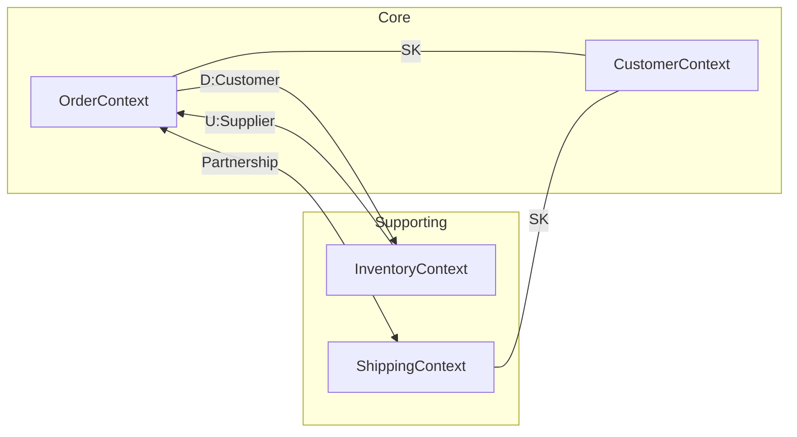

# Context Mapper DSL (CML) Syntax Reference

Complete syntax reference for Context Mapper DSL used to define bounded context relationships.

## Basic Structure

### Context Map Declaration

```cml
ContextMap <MapName> {
    // Context declarations
    contains <Context1>
    contains <Context2>

    // Relationship declarations
    <relationships>
}
```

### Bounded Context Declaration

```cml
BoundedContext <ContextName> {
    // Optional: implementation details
    implementationTechnology = "C#"

    // Optional: aggregates
    Aggregate <AggregateName> {
        // entities, value objects
    }
}
```

## Relationship Syntax

### Asymmetric Relationships (Upstream/Downstream)

```cml
// Basic format
<Downstream> [D]<-[U] <Upstream>

// With patterns
<Downstream> [D,<patterns>]<-[U,<patterns>] <Upstream>
```

**Arrow Direction:** Always points from Upstream to Downstream (`<-`)

### Symmetric Relationships

```cml
// Basic format
<Context1> []<->[] <Context2>

// With patterns
<Context1> [<patterns>]<->[<patterns>] <Context2>
```

**Arrow Direction:** Bidirectional (`<->`)

## Pattern Abbreviations

### Downstream Patterns

| Abbrev | Full Name | Description |
| ------ | --------- | ----------- |
| `D` | Downstream | Basic downstream role |
| `C` | Customer | Customer in Customer/Supplier |
| `CF` | Conformist | Adopts upstream model |
| `ACL` | Anti-Corruption Layer | Translates upstream model |

### Upstream Patterns

| Abbrev | Full Name | Description |
| ------ | --------- | ----------- |
| `U` | Upstream | Basic upstream role |
| `S` | Supplier | Supplier in Customer/Supplier |
| `OHS` | Open Host Service | Formal API provider |
| `PL` | Published Language | Documented contract |

### Symmetric Patterns

| Abbrev | Full Name | Description |
| ------ | --------- | ----------- |
| `SK` | Shared Kernel | Shared code/model |
| `P` | Partnership | Equal collaboration |

## Common Relationship Patterns

### Customer/Supplier

```cml
OrderContext [D,C]<-[U,S] InventoryContext
```

Reads as: "OrderContext is downstream Customer, InventoryContext is upstream Supplier"

### Anti-Corruption Layer

```cml
PaymentContext [D,ACL]<-[U] ExternalGateway
```

Reads as: "PaymentContext is downstream with ACL, ExternalGateway is upstream"

### Open Host Service with Published Language

```cml
ConsumerContext [D]<-[U,OHS,PL] ProviderContext
```

Reads as: "ProviderContext provides OHS with PL to ConsumerContext"

### Conformist

```cml
ReportingContext [D,CF]<-[U] DataWarehouse
```

Reads as: "ReportingContext conforms to DataWarehouse model"

### Shared Kernel

```cml
OrderContext [SK]<->[SK] CustomerContext
```

Reads as: "OrderContext and CustomerContext share a kernel"

### Partnership

```cml
OrderContext [P]<->[P] ShippingContext
```

Reads as: "OrderContext and ShippingContext are partners"

## Combined Patterns

Multiple patterns can be combined with commas:

```cml
// Downstream is Customer with ACL
OrderContext [D,C,ACL]<-[U,S] LegacyInventory

// Upstream is Supplier with OHS and PL
ClientContext [D,C]<-[U,S,OHS,PL] ProductCatalog
```

## Comments

CML supports single-line and multi-line comments:

```cml
ContextMap MyMap {
    // Single line comment
    contains OrderContext

    /* Multi-line comment
     * explaining the relationship
     */
    OrderContext [D,C]<-[U,S] InventoryContext
}
```

## Complete Example

```cml
/* Context Map: E-Commerce Platform
 * Generated from event storming session
 * Author: Architecture Team
 * Date: 2025-01-15
 */

ContextMap ECommercePlatform {
    // Core domain
    contains OrderContext
    contains CustomerContext

    // Supporting domains
    contains InventoryContext
    contains ShippingContext
    contains NotificationContext

    // Generic domains
    contains PaymentContext

    // External systems
    contains ExternalPaymentGateway
    contains ShippingCarrierAPI

    /* Core Relationships */

    // Order consumes inventory availability
    // Inventory owns stock truth
    OrderContext [D,C]<-[U,S] InventoryContext

    // Customer data shared between Order and Shipping
    // CustomerInfo value object reused
    OrderContext [SK]<->[SK] CustomerContext
    ShippingContext [SK]<->[SK] CustomerContext

    // Order and Shipping collaborate on fulfillment
    // Both teams co-evolve the process
    OrderContext [P]<->[P] ShippingContext

    /* External Integrations */

    // Payment isolates external gateway
    // Foreign model requires translation
    PaymentContext [D,ACL]<-[U,OHS,PL] ExternalPaymentGateway

    // Shipping integrates with carriers
    // Carrier API is stable, we conform
    ShippingContext [D,CF]<-[U,OHS] ShippingCarrierAPI

    /* Supporting Relationships */

    // Notifications consume events from Order
    // One-way dependency
    NotificationContext [D,C]<-[U,S] OrderContext
}
```

## Context Definition Details

For more detailed context definitions:

```cml
BoundedContext OrderContext implements OrderDomain {
    type = CORE_DOMAIN
    implementationTechnology = "C# / .NET 8"

    Aggregate Order {
        Entity Order {
            aggregateRoot

            - OrderId id
            - CustomerId customerId
            - List<OrderItem> items
            - OrderStatus status
            - Money totalAmount
        }

        ValueObject OrderItem {
            - ProductId productId
            - int quantity
            - Money unitPrice
        }
    }

    Aggregate Cart {
        Entity ShoppingCart {
            aggregateRoot

            - CartId id
            - CustomerId customerId
            - List<CartItem> items
        }
    }
}
```

## Validation Rules

CML enforces these rules:

1. **Context names must be unique** within a ContextMap
2. **Relationships require declared contexts** - use `contains` first
3. **Symmetric patterns** must appear on both sides (`[SK]<->[SK]`)
4. **Downstream marker `[D]`** required for asymmetric downstream
5. **Upstream marker `[U]`** required for asymmetric upstream

## Generating Diagrams

Context Mapper can generate:

- **PlantUML diagrams** from CML
- **Graphviz diagrams** from CML
- **Service blueprints** from CML

```bash
# Using Context Mapper CLI
cm generate plantuml -i context-map.cml -o diagrams/
```

## Mermaid Equivalent

For tools not supporting CML, use Mermaid:


